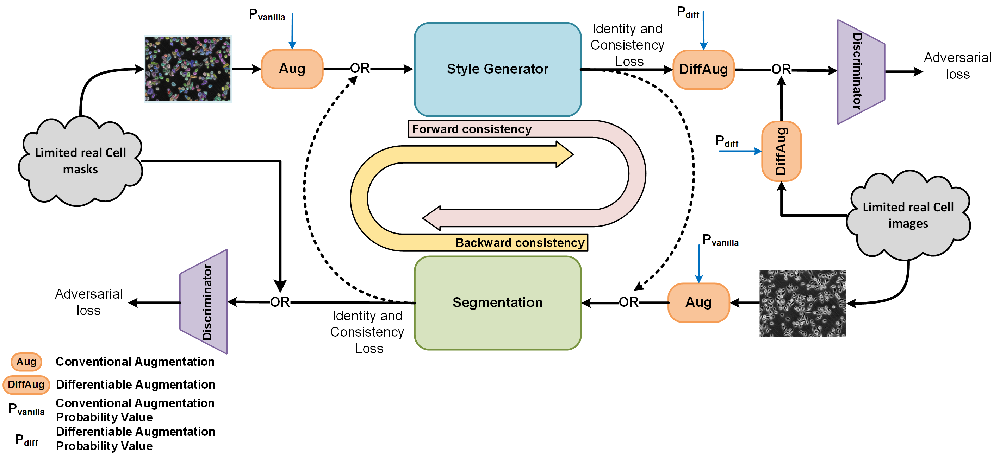

# cGAN-Seg

This repository hosts the training and evaluation code for "cGAN-Seg: A Generative Adversarial Network for Enhanced Cell Segmentation with Limited Training Datasets." Our approach utilizes a modified CycleGAN architecture to train cell segmentation models effectively with a limited number of annotated cell images, addressing the challenge of scarce annotated data in microscopy imaging. This method not only diversifies training data but also improves the synthetic sample authenticity, thereby enhancing the segmentation model's accuracy and robustness. 

### Datasets
We employed several segmentation datasets in our experiments, including DeepSea, CellPose, LiveCell, and Cell Tracking Challenge images alongside their corresponding masks. Access the datasets here: [cGAN-Seg_datasets](https://drive.google.com/drive/folders/1ZYkNA4mm6xaAjm51vfg1YL2kgDfp4OPD?usp=sharing)

### Requirements

* Optional: Create a conda or Python virtual environment.

* Install the required packages using:
```
pip install -r requirements.txt
```

### Usage
#### Training the cGAN-Seg Model
Train the model with your dataset or use our provided cGAN-Seg dataset. Adjust hyperparameters, including the segmentation model type (DeepSea, CellPose, or UNET) and early stopping 'patience' value (recommended: >=500 if dataset is limited). During training, the script logs the training process and also saves the segmentation, generator, and discriminator checkpoints (Seg.pth, Gen.pth, D1.pth, and D2.pth) to the specified output_dir. 
```
Example:
python train.py --seg_model DeepSea --train_set_dir  .../cGAN-Seg_datasets/DeepSea_datasets/mouse_embryonic_stem_cell_dataset/train/  --lr 0.0001 --p_vanilla 0.2 --p_diff 0.2 --patience 500 --output_dir tmp/
```

#### Testing the Segmentation Model
Evaluate your segmentation model using our cGAN-Seg dataset or yours, specifying the segmentation model type (seg_model) and its checkpoint directory (seg_ckpt_dir). You can download some cGAN-Seg checkpoints (Seg.pth) for testing from this [cGAN-Seg_checkpoints](https://drive.google.com/drive/folders/19V11wBxALoABvsfq8nNZqP1PmuC4Cl_R?usp=sharing) link. This script calculates and returns segmentation metrics for the test set, including loss, Dice score, average F-score, precision, and recall. Additionally, it saves the predicted mask images to the specified output_dir.
```
Example:
python test_segmentation_model.py --seg_model DeepSea --test_set_dir .../cGAN-Seg_datasets/DeepSea_datasets/mouse_embryonic_stem_cell_dataset/test/ --seg_ckpt_dir .../cGAN-Seg_checkpoints/deepsea_model/mouse_embryonic_stem_cells/Seg.pth --output_dir tmp/
```
#### Testing the Generator Model
Evaluate the StyleUNET generator's performance, using the synthetic or real mask images. You can download some cGAN-Seg checkpoints (Gen.pth) for testing from this [cGAN-Seg_checkpoints](https://drive.google.com/drive/folders/19V11wBxALoABvsfq8nNZqP1PmuC4Cl_R?usp=sharing) link. The script calculates the FID metric and, if an output_dir is provided, generates and stores synthetic images there.
```
Example:
python test_generation_model.py --test_set_dir .../cGAN-Seg_datasets/DeepSea_datasets/mouse_embryonic_stem_cell_dataset/test/ --gen_ckpt_dir .../cGAN-Seg_checkpoints/deepsea_model/mouse_embryonic_stem_cells/Gen.pth --output_dir tmp/
```

#### Generating Synthetic High-Density and Colony-Like Cell Images
Generate synthetic high-density and colony-like cell images using the trained StyleUNET generator and the synthetic or real mask images, following the approach described in our paper and illustrated in Figure 5.
Teh script generate_high_density.py creates synthetic, high-density, and colony-like mask images. These generated masks are then used by the trained StyleUNET generator to produce corresponding synthetic cell images, enhancing the model's ability to tackle complex segmentation scenarios.  
```
Example:
python generate_high_density_masks.py --real_mask_set_dir .../cGAN-Seg_datasets/DeepSea_datasets/mouse_embryonic_stem_cell_dataset/test/masks/ --synthetic_mask_set_dir /synthetic_high_density_dataset/

Then:

python test_generation_model.py --test_set_dir /synthetic_high_density_dataset/ --gen_ckpt_dir .../cGAN-Seg_checkpoints/deepsea_model/mouse_embryonic_stem_cells/Gen.pth --output_dir /synthetic_high_density_dataset/

```

### Useful Information
If you have any questions, contact us at abzargar@ucsc.edu.

